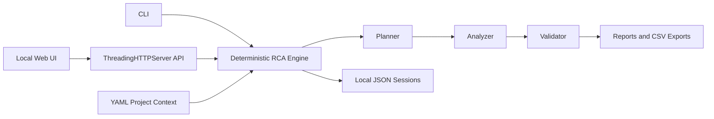

# Architecture and Evaluator Applicability

Version: v2  
Date: 2026-09-22  
Maintainer and release owner: Jose Mora

## Current release boundary

This release is a local, single-user, deterministic QA workflow for synthetic and non-sensitive artifacts. It is not a cloud service, multi-tenant platform, or LLM application.

The runtime uses Python rules and bounded workflow steps:

There is no external model provider, model endpoint, token billing, inference API, network call for analysis, or model-generated output in the current implementation. The planner, analyzer, and validator are deterministic Python functions. Interactive RCA is bounded by configured Why depth.

Quick Plans are deterministic execution fixtures for CLI, GitHub Actions, golden regression, and QA automation. They are intentionally not exposed as a Web UI action because the Web UI already provides the equivalent user-facing Demo Case workflow.

## Controls that are not applicable to this release

The following evaluator controls require an LLM or external inference path and therefore are not current omissions:

- Model router, provider abstraction, model IDs, and model cards
- Token consumption tracking, token budgets, and token spend kill-switches
- Inference-path content filters, PII detection, prompt-injection detection, and model refusal handling
- LLM mocking, malformed LLM-output parsing, LLM-as-judge calibration, and tone scoring by an LLM
- Prompt injection, jailbreak, system-prompt exfiltration, and LLM-specific adversarial probes
- GenAI OpenTelemetry attributes and LLM latency/token metrics

These controls are intentionally deferred. They become mandatory before any future LLM-backed phase is enabled. The future contract requires an injectable provider, network-denied CI, deterministic mocks, per-session and per-feature token ceilings, input/output guardrails, prompt/version traceability, malformed-output tests, adversarial probes, and human approval before model output can influence a write.

## Controls that remain applicable now

The absence of an LLM does not remove these current obligations:

- CI regression gates and a formal deterministic golden dataset
- Path confinement, synthetic-data enforcement, and output guardrails
- Human approval before export commit and explicit overwrite confirmation
- Atomic writes, safe error handling, request correlation, and structured local logs
- Agent-step telemetry for the deterministic planner/analyzer/validator sequence
- Architecture, operations, retention, rollback, ownership, and release documentation
- Positive, negative, and boundary tests for paths, sessions, exports, malformed input, and state transitions

## Deployment decision

The current release is approved only for controlled local synthetic-data validation. Shared, cloud, regulated, or multi-user deployment is out of scope. Such a deployment would require a new architecture and security review covering authentication, authorization, tenant isolation, intent capsules, retention enforcement, monitoring, immutable audit storage, data residency, and rollback.

## Data handling

- Data classification: Internal synthetic/non-sensitive QA artifacts only.
- PII and production/customer data: prohibited.
- External data export: prohibited.
- Default retention: 360 days for local synthetic sessions, reports, exports, and application logs, subject to organizational policy.
- Maintainer/release owner: Jose Mora.
- CI platform: GitHub Actions.
- Containerization: not required for this local release.

## Release governance

Exports will use separate preview and commit endpoints. Preview must not mutate the filesystem. Commit requires explicit approval bound to the exact generated content, target path, and session/options; existing files require explicit overwrite confirmation. Production or distributable approval remains blocked until these controls and the deterministic CI/browser evidence gates pass.
